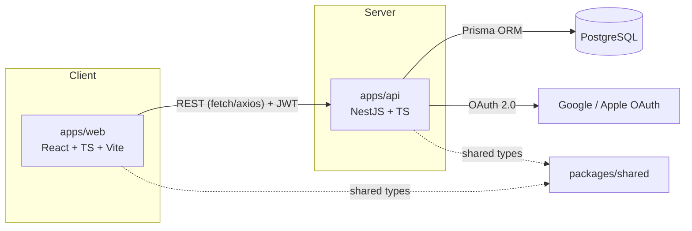

# Arquitectura — Cycles

Ver [`docs/prds/PRD-General.md`](./prds/PRD-General.md) para el contexto de producto (y [`docs/prds/README.md`](./prds/README.md) para la convención de PRDs enlazados). Este documento describe la arquitectura técnica base sobre la que se construirá la plataforma.

## 1. Visión general



## 2. Estructura del monorepo

```
cycles/
├── apps/
│   ├── web/     # SPA React (coach + atleta)
│   └── api/     # API REST NestJS
├── packages/
│   └── shared/  # Tipos/DTOs compartidos entre web y api
└── docs/        # PRD y arquitectura
```

Se usa un **monorepo con npm workspaces** para poder compartir tipos (DTOs, enums de dominio) entre frontend y backend sin publicar un paquete, y para poder evolucionar ambos lados en un mismo PR cuando un cambio de API los toca a la vez.

## 3. Frontend (`apps/web`)

- **Stack:** React 18, TypeScript, Vite, CSS Modules.
- **Organización por carpeta:**
  - `components/` — componentes de UI reutilizables, sin lógica de negocio.
  - `pages/` — vistas ruteadas (dashboard de coach, detalle de ciclo, vista de sesión del atleta, login).
  - `hooks/` — hooks de datos y de UI.
  - `services/` — clientes HTTP hacia la API (uno por dominio: `authService`, `cyclesService`, etc.).
  - `store/` — estado global de cliente (a definir: Zustand/Context) para sesión de usuario y UI compartida.
  - `types/` — tipos específicos de frontend; los tipos de dominio compartidos con la API viven en `packages/shared`.
  - `styles/` — variables globales de CSS (tokens de color, tipografía, espaciado).
- **Ruteo:** por definir en Fase 1 (React Router es la opción por defecto).
- **Estado de servidor:** se recomienda React Query para cachear y sincronizar datos de la API (a confirmar en Fase 1).

## 4. Backend (`apps/api`)

- **Stack:** Node.js, TypeScript, NestJS, Prisma ORM, PostgreSQL.
- **Organización modular por dominio** (patrón estándar de NestJS): cada carpeta bajo `src/` es un módulo con su `controller`, `service`, `dto` y `module`.
  - `auth/` — login manual (con verificación de email), OAuth Google, emisión y refresh de JWT. Apple queda pospuesto (ver `docs/prds/features/PRD-Autenticacion.md`).
  - `users/` — perfil de usuario, roles.
  - `athletes/` — relación coach–atleta (invitación, aceptación, listado).
  - `cycles/` — CRUD de ciclos de entrenamiento.
  - `sessions/` — sesiones dentro de un ciclo.
  - `exercises/` — catálogo de ejercicios y registro de ejecución (`ExerciseLog`).
  - `common/` — guards (roles, auth), decoradores, filtros de excepción, pipes de validación.
  - `prisma/` — `PrismaService` (cliente inyectable) y el schema del ORM.
- **Autenticación:** Passport.js dentro de NestJS con dos estrategias en el MVP: `local` (email/contraseña, con verificación de email obligatoria) y `google-oauth20` (con vinculación automática por email si ya existe una cuenta manual). `apple` queda documentada como estrategia futura, no implementada aún. Emisión de JWT de acceso (corta duración) + refresh token (rotativo, almacenado hasheado).
- **Autorización:** guards basados en rol (`coach`, `athlete`, `admin`) y en pertenencia (un coach solo accede a sus atletas/ciclos).
- **Validación:** DTOs con `class-validator` en cada endpoint de entrada.
- **Documentación de API:** Swagger/OpenAPI autogenerado (`@nestjs/swagger`).

## 5. Base de datos

- **Motor:** PostgreSQL.
- **ORM:** Prisma (migraciones versionadas en `apps/api/prisma/migrations`, cliente tipado autogenerado).
- **Esquema base:** ver `apps/api/prisma/schema.prisma`, que refleja el modelo de datos descrito en el PRD (`User`, `CoachAthlete`, `TrainingCycle`, `TrainingSession`, `Exercise`, `SessionExercise`, `ExerciseLog`).

## 6. Paquete compartido (`packages/shared`)

Contiene tipos TypeScript e interfaces de DTOs de dominio (por ejemplo, la forma de un `TrainingCycle` tal como viaja por la API) para que frontend y backend no diverjan. No contiene lógica de negocio ni acceso a datos.

## 7. Autenticación — flujo resumido

1. **Manual:** registro con email/contraseña → hash con bcrypt → email de verificación → login solo permitido tras verificar → emite JWT + refresh token.
2. **Google (OAuth 2.0):** el frontend inicia el flujo OAuth; el backend recibe el callback y busca un `User` por email — si existe (creado manualmente), lo vincula; si no, lo crea — y emite JWT + refresh token igual que en el flujo manual, de modo que el resto de la app no distingue el método de login una vez autenticado. Apple seguiría este mismo patrón cuando se implemente.
3. Todas las rutas protegidas de la API validan el JWT vía guard; el rol embebido en el token determina el acceso.

## 8. Próximos pasos técnicos (no incluidos en este scaffolding)

- Definir librería de estado de servidor y ruteo en frontend.
- Configurar Prisma con una base de datos real y primera migración.
- Implementar los flujos de autenticación del MVP: manual (con verificación de email) y Google (`auth` module) — ver [[PRD-Autenticacion]].
- Definir estrategia de despliegue (ver "Decisiones abiertas" en el PRD).
- Configurar CI (lint, typecheck, tests) para el monorepo.
