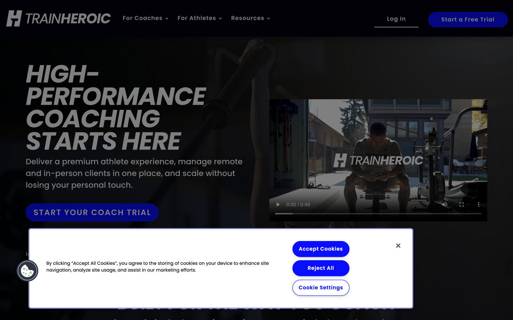
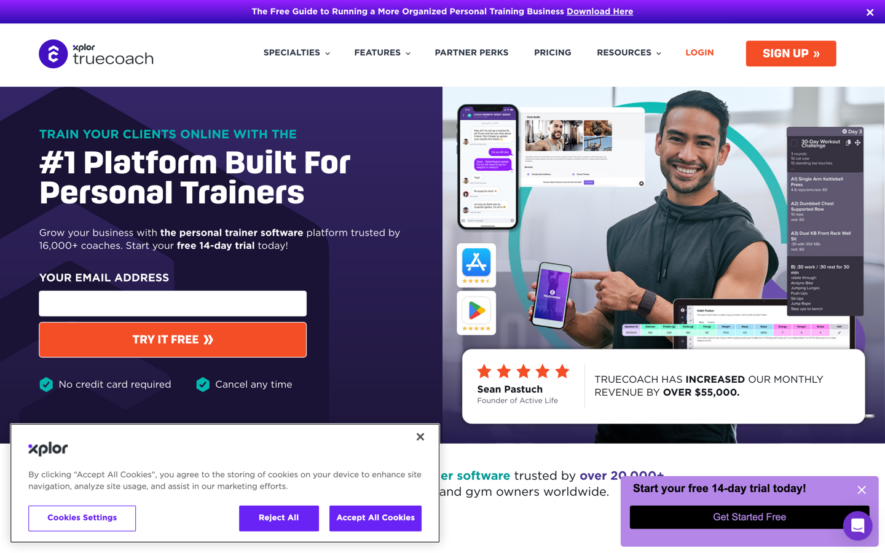
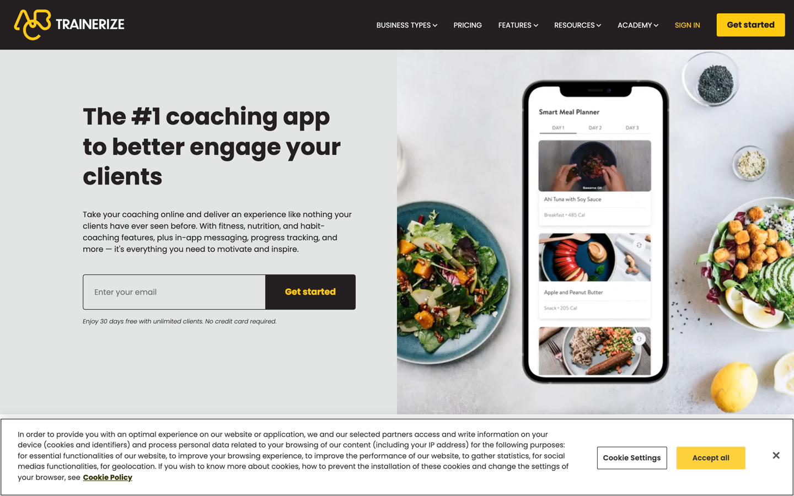
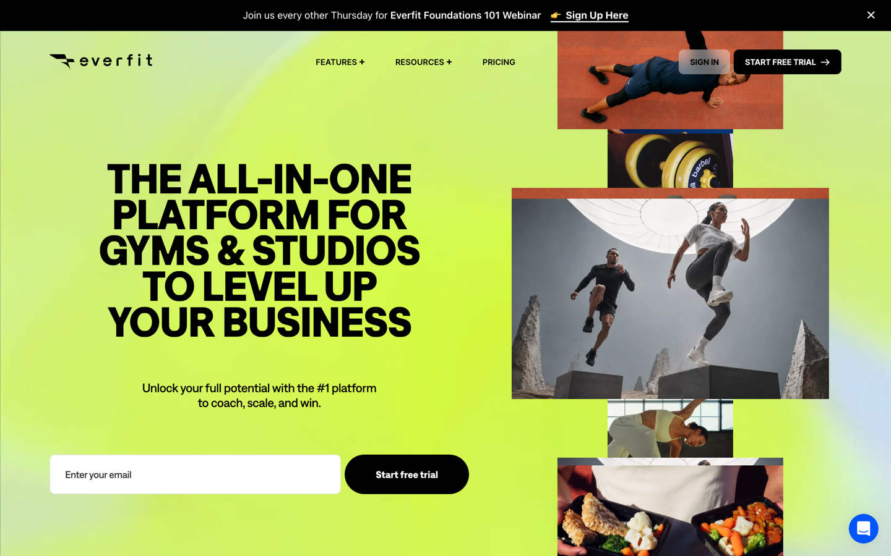
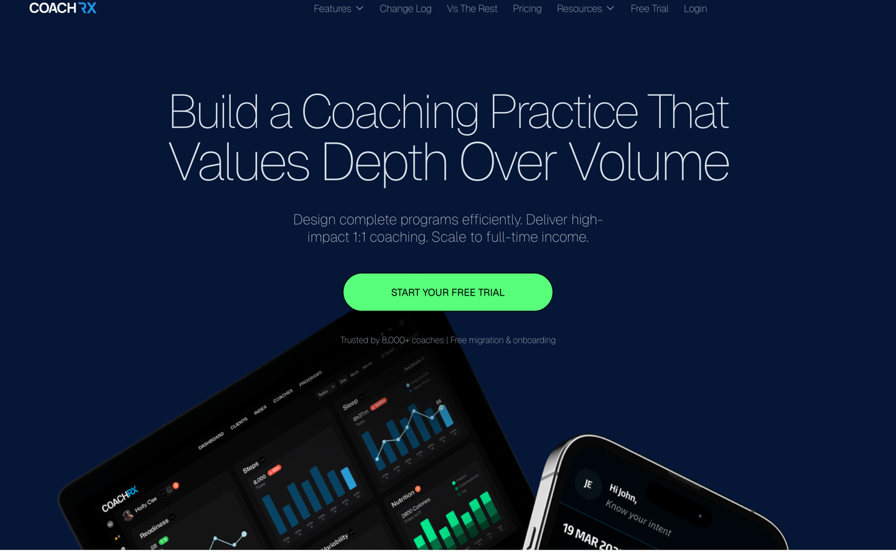

> Documento informativo — no contiene recomendaciones de diseño ni decisiones tomadas. Es un insumo para que quien trabaje la identidad visual de [[brand|CYCLES]] lo lea y decida. Ver [[brand]] para la estrategia de marca ya definida (personalidad, territorio visual, posicionamiento).

# Investigación competitiva — plataformas de coaching/entrenamiento

## Metodología

Se analizaron las páginas de marketing (landing pages dirigidas al coach) de 5 plataformas reales que compiten en el espacio de "software para que un entrenador gestione atletas/clientes a distancia". Para cada una:

- Se capturó la página con Playwright (Chromium headless) en desktop (1440×900, retina) y se guardó el screenshot del *fold* (lo que ve un visitante sin scrollear).
- Se extrajo la **paleta de color real** muestreando los píxeles del screenshot (no adivinada — colores medidos y su porcentaje de área real en pantalla).
- Se extrajeron **fuentes tipográficas, tamaños y radios de borde** leyendo los estilos computados del DOM.
- Se identificaron manualmente: mensaje principal, a quién le habla, y tono.

**Limitaciones** (léase antes de sacar conclusiones):
- Solo se analizaron las páginas de **marketing/venta**, no el producto real logueado (dashboards, apps móviles). El tono de venta puede no reflejar el tono del producto en uso diario.
- Una sola captura por sitio, en un momento dado (22 de septiembre de 2026) — estas páginas cambian con frecuencia.
- No se evaluó accesibilidad, performance, ni el flujo de uso real (onboarding, app del atleta).
- Los screenshots de referencia están guardados junto a este documento (`docs/brand/investigacion-competitiva/*.png`) por si la página de origen cambia.

## Tabla comparativa

| | [TrainHeroic](https://www.trainheroic.com/coach/) | [TrueCoach](https://truecoach.co/) | [Trainerize](https://www.trainerize.com/) | [Everfit](https://everfit.io/) | [CoachRx](https://www.coachrx.app/) |
|---|---|---|---|---|---|
| **Mensaje principal** | "High-performance coaching starts here" | "#1 Platform Built For Personal Trainers" | "The #1 coaching app to better engage your clients" | "The all-in-one platform for gyms & studios to level up your business" | "Build a coaching practice that values depth over volume" |
| **A quién le habla** | Al coach de fuerza/rendimiento, tono atlético | Al personal trainer como dueño de negocio | Al coach de fitness/nutrición general | A gyms y estudios como negocio | Al coach que quiere calidad sobre volumen de clientes |
| **Color dominante medido** | Negro casi puro `#030304` (58.5% del área) | Blanco `#ffffff` (40%) + violeta oscuro `#1a1335` (22%) | Gris neutro `#e3e5e5` (51%), sin acento de color | Verde lima `#d2f36c` (**46%** del área) | Azul marino `#061636` (**80%** del área) |
| **Acento** | Azul vívido `#0a0eff` | Violeta vívido `#6923f4`, naranja en CTAs | Amarillo (marca), sin acento adicional detectado | Negro sobre el verde lima | Verde vívido `#58ff7a` (CTA en píldora) |
| **Tipografía** | Poppins (geométrica, bold, condensada) | Gotham (premium, SaaS) | Poppins | Inter + fuente display propia + **monospace** (Victor Mono) | Geist + Inter (fuentes de herramientas dev/tech) |
| **Radios de borde** | Muy grandes (píldora: 100px, 90px, 50px) | Chicos (5-8px) | Chicos (2-4px), algo píldora en botones | Medianos (8-14px) | Muy grandes (píldora: 300px, 24px) |
| **Imagen principal** | Video real de atleta entrenando | Foto stock de trainer sonriendo con el teléfono | Screenshot de app de meal-planning + comida | Collage de fotos de atletas en acción | **Dashboard con gráficos reales** (sueño, pasos, nutrición) |
| **Prueba social** | — | "+16,000 coaches", reseña de 5 estrellas, +$55k de ingresos | — | — | "+8,000 coaches" |
| **CTA principal** | "Start Your Coach Trial" (píldora azul) | Formulario de email en el propio hero | Formulario de email en el propio hero | Formulario de email en el propio hero | "Start Your Free Trial" (píldora verde) |

## Ficha por competidor

### TrainHeroic

El más cercano a Cycles en términos de **funcionalidad** (programas con series/reps/carga/RPE, biblioteca de ejercicios con video, dashboards de rendimiento). Visualmente es el más "hardcore gym": negro casi total, tipografía condensada en mayúsculas, video real de un atleta entrenando. Fue adquirida por Garmin (dueño de TrainingPeaks) en julio de 2026 — señal de validación de mercado en este nicho específico.

### TrueCoach

Parte de "Xplor" (conglomerado de software para negocios de fitness/wellness). El mensaje central es de **crecimiento de negocio del coach** (ingresos, cantidad de clientes), no de rendimiento del atleta. Fuerte uso de prueba social y formulario de captura de email directo en el hero — patrón de marketing B2B agresivo.

### Trainerize

El más genérico de los cinco: sin acento de color, imagen de comida/nutrición en el hero (no de entrenamiento de fuerza), mensaje de "engagement" del cliente. Se posiciona como generalista de fitness+nutrición+hábitos, no específicamente de rendimiento deportivo.

### Everfit

El más ruidoso visualmente: fondo con gradiente verde lima neón, tipografía negra condensada enorme, collage de fotos de acción. Habla directamente a gimnasios/estudios como negocio a escalar ("level up your business"), tono muy Gen-Z/energético.

### CoachRx

El único de los cinco que usa **visualización de datos real** (gráficos de sueño, pasos, nutrición) como imagen principal, sobre fondo azul marino oscuro con acento verde vívido en píldora. Tipografía fina, casi elegante (Geist/Inter), contraste con lo "hardcore" de TrainHeroic. El copy "values depth over volume" es una posición explícita contra competidores que compiten por cantidad de clientes — parecida en espíritu a por qué [[brand]] plantea "Athlete Performance Management" en vez de "Training Tracking".

## Patrones observados entre los 5

- **Los 5 le hablan al coach como dueño de un negocio a hacer crecer** ("scale", "grow your revenue", "engage clients", "level up your business", "full-time income") — ninguno lidera con el valor del historial/proceso del atleta a través del tiempo.
- **4 de 5 usan fotografía de personas** (stock o real) como imagen principal; solo CoachRx usa datos/gráficos, y lo hace en formato "dashboard de métricas diarias" (sueño, pasos, nutrición), no en formato "progresión a través de bloques/ciclos de entrenamiento".
- **Ninguno usa un motivo visual circular/cíclico/de loop.**
- Paletas ya ocupadas en este espacio competitivo: negro+azul (TrainHeroic), violeta (TrueCoach), amarillo (Trainerize), verde lima (Everfit), azul marino+verde vívido (CoachRx).
- Tipografía: predominan sans geométricas/grotescas (Poppins, Inter, Gotham, Geist) — ninguno usa serif ni una tipografía con carácter "editorial".
- Radios de borde: hay dos grupos claros — píldora/muy redondeado (TrainHeroic, CoachRx) vs. esquinas chicas/casi rectas (TrueCoach, Trainerize).

## Relación con la estrategia de marca ya definida

[[brand|El documento de marca]] (sección 14, "Territorio visual") ya propone construir la identidad alrededor de **ciclos, círculos, loops, órbitas** y de **datos/gráficos/series temporales** — ninguno de los 5 competidores analizados ocupa ese territorio visual hoy. La sección 12-13 pide una personalidad "científica, precisa, humana" evitando "corporativa, clínica, fría" — de los 5, CoachRx es el que más se acerca a "preciso" sin caer en "hardcore" (TrainHeroic) ni en "ruidoso" (Everfit), pero mantiene un mensaje de negocio ("Scale to full-time income") que [[brand]] explícitamente busca evitar como eje central (sección 17: la diferenciación no debería ser "registramos entrenamientos" sino "la continuidad del proceso y el valor acumulativo de los datos").

Este documento no propone qué colores, tipografía o tono elegir — esa decisión queda para cuando se trabaje la identidad visual del producto.
