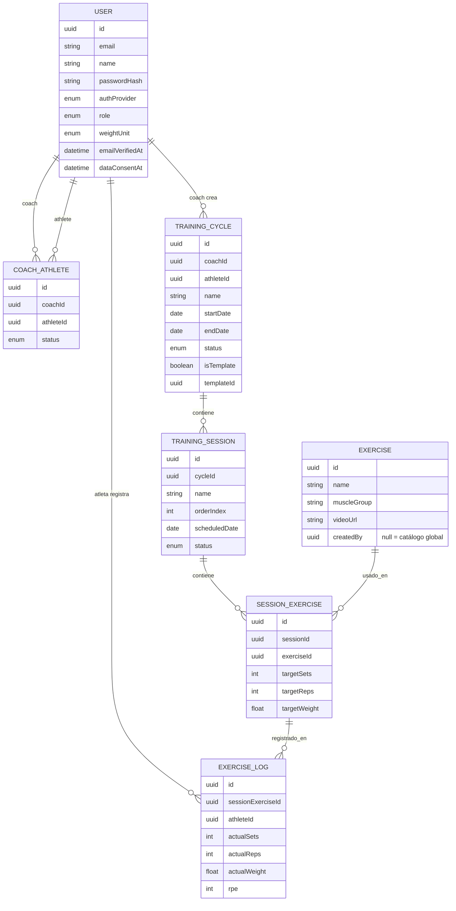

# PRD — Cycles: Plataforma de Ciclos de Entrenamiento

> Este es el **PRD padre del producto Cycles**. Cycles es, a su vez, el primer producto de una visión de compañía más amplia — ver [[VISION]]. Cada funcionalidad de Cycles se documenta en su propio PRD hijo dentro de `docs/prds/features/`, enlazado desde aquí. Ver [[README|convención de PRDs]] para cómo crear uno nuevo.

## 0. PRDs hijos / Funcionalidades

| Funcionalidad | Fase | Estado | PRD |
|---|---|---|---|
| Autenticación (manual + Google, verificación de email) | Fase 1 | in-progress | [[PRD-Autenticacion]] |

> Esta tabla se actualiza a mano cada vez que se crea un PRD hijo nuevo (ver plantilla en `_templates/PRD-Feature-Template.md`). Además, como cada PRD hijo enlaza de vuelta a `[[PRD-General]]` en su frontmatter, el panel de **Linked mentions / Backlinks** de Obsidian en esta nota mostrará automáticamente todos los hijos, aunque se te olvide actualizar la tabla.

## 1. Resumen

Cycles es una aplicación web donde entrenadores (coaches) diseñan, asignan y dan seguimiento a ciclos de entrenamiento para sus atletas, y donde los atletas consultan sus sesiones y registran su progreso. Es, además, el primer producto de una compañía enfocada en correlacionar datos deportivos y de salud para impulsar el rendimiento atlético (ver [[VISION]]) — por lo que la calidad y consistencia de los datos que captura importan más allá del propio producto.

## 2. Problema

Los coaches hoy gestionan la planificación de entrenamientos en hojas de cálculo, PDFs o apps genéricas de mensajería, lo que dificulta el seguimiento histórico, la reutilización de planes y la visibilidad del progreso real del atleta.

## 3. Objetivos

- Permitir a un coach crear ciclos de entrenamiento estructurados (sesiones, ejercicios, cargas objetivo) y asignarlos a uno o más atletas.
- Permitir a un atleta ver su plan vigente y registrar lo realmente ejecutado (series, reps, peso, percepción de esfuerzo).
- Dar al coach visibilidad de la adherencia y el progreso de cada atleta.
- Soportar autenticación con Google y registro manual (email/contraseña) en el MVP; Apple queda para una fase posterior (ver [[PRD-Autenticacion]]).
- Capturar los datos de ejecución con la consistencia suficiente (unidades normalizadas, timestamps UTC, sin pérdida de detalle) para que puedan alimentar, más adelante, el motor de correlación descrito en [[VISION]].

### No objetivos (fuera del MVP)

- Pagos/suscripciones dentro de la plataforma (se retoma cuando exista tracción real, ver [[VISION]]).
- Nutrición y seguimiento de dieta.
- Chat en tiempo real entre coach y atleta (tampoco comentarios asíncronos por sesión en el MVP — se reevalúa en Fase 3).
- Multi-tenant por gimnasio/organización (se documenta como evolución futura, no se implementa en el MVP).
- Integraciones con wearables (Garmin, Polar, Google Fit, Strava): son parte de la visión de compañía, pero no se modelan ni implementan hasta que exista una integración real que las valide (ver [[VISION]], sección 3).
- Internacionalización: el MVP se construye solo en español; no se agrega capa de i18n todavía.

## 4. Usuarios y roles

| Rol | Descripción |
|---|---|
| **Coach** | Crea y gestiona atletas, ciclos, sesiones y ejercicios. Consulta el progreso de sus atletas. |
| **Atleta** | Pertenece a un único coach activo a la vez. Consulta sus ciclos/sesiones asignadas y registra su ejecución real. |
| **Admin** | Rol interno de plataforma para soporte y moderación (gestión de usuarios, catálogo global de ejercicios). |

Roles excluyentes: un usuario es coach **o** atleta, nunca ambos con la misma cuenta (si un coach quiere entrenar con otro coach, usa una segunda cuenta).

### Relación coach–atleta

- **Alta:** solo por invitación del coach (por email). El atleta no puede auto-registrarse eligiendo el rol "atleta" sin invitación previa; completa su registro (manual, o vinculando Google) a partir del link de invitación.
- **Cardinalidad:** un atleta tiene como máximo **un coach activo a la vez** (`CoachAthlete.status = 'active'` es único por atleta). Puede tener relaciones anteriores en `status = 'inactive'` (histórico).
- **Fin de relación:** cuando termina, la relación pasa a `inactive`. El **coach pierde acceso** a los ciclos/datos de ese atleta desde ese momento (sus queries solo consideran relaciones activas). El **atleta conserva acceso total** a su propio historial sin restricción. A nivel de compañía (no de producto), el dato no se borra — sigue existiendo como activo de datos sujeto al consentimiento del atleta (ver [[VISION]] y sección 8 de este documento).

## 5. Historias de usuario clave (MVP)

1. Como **coach**, quiero registrarme e iniciar sesión con Google o email/contraseña, para acceder a la plataforma con el método que prefiera. → detalle en [[PRD-Autenticacion]]
2. Como **coach**, quiero invitar a un atleta por email, para vincularlo a mi cuenta.
3. Como **coach**, quiero crear un ciclo de entrenamiento con nombre, objetivo, fechas de inicio/fin y sesiones, para planificar el trabajo de un atleta.
4. Como **coach**, quiero agregar ejercicios a cada sesión con series/repeticiones/peso objetivo, para dejar instrucciones claras.
5. Como **atleta**, quiero ver mi ciclo activo y las sesiones de la semana, para saber qué entrenar.
6. Como **atleta**, quiero registrar lo que realmente hice en cada ejercicio (series, reps, peso, RPE), para dejar constancia de mi progreso.
7. Como **coach**, quiero ver el historial de registros de un atleta por ciclo, para ajustar la planificación futura.
8. Como **usuario**, quiero recuperar mi contraseña si me registré manualmente, para no perder acceso a mi cuenta. → detalle en [[PRD-Autenticacion]]

> A medida que se creen PRDs hijos para las historias 2–7 (invitaciones, ciclos, sesiones, registro de progreso), enlázalas aquí igual que se hizo con autenticación.

## 6. Modelo de datos (alto nivel)

Ver el esquema completo (Prisma) en `apps/api/prisma/schema.prisma`. El modelo de datos completo es propiedad de este PRD general; los PRDs hijos solo documentan **deltas** (campos o tablas nuevas) cuando aplica, no lo repiten.

Notas sobre campos agregados tras la definición de [[VISION]]:

- `User.weightUnit` (`kg` | `lb`, default `kg`): preferencia de visualización del usuario. Todo se **almacena internamente en kg**; la conversión ocurre en la capa de presentación.
- `User.emailVerifiedAt`: nulo hasta que el usuario confirma su email (obligatorio para login manual; no aplica a login con Google).
- `User.dataConsentAt` / `dataConsentVersion`: consentimiento explícito del atleta para el uso de sus datos en analítica agregada/futura (ver [[VISION]], principio de consentimiento). Se captura en el registro.
- `TrainingCycle.isTemplate` / `templateId`: soporta que un coach cree un ciclo como plantilla y lo duplique para distintos atletas (`templateId` referencia al ciclo origen cuando aplica).
- `Exercise.createdBy`: nulo para el catálogo global (seed inicial), o el `id` del coach cuando es un ejercicio propio suyo (no visible para otros coaches).

## 7. Arquitectura técnica

Ver detalle completo en [`docs/ARCHITECTURE.md`](../ARCHITECTURE.md). Resumen:

- **Frontend:** React 18 + TypeScript + Vite, CSS Modules.
- **Backend:** Node.js + TypeScript + NestJS, arquitectura modular por dominio.
- **Base de datos:** PostgreSQL (relacional) + Prisma ORM.
- **Autenticación:** JWT (access + refresh token), OAuth 2.0 con Google (Apple pospuesto, ver [[PRD-Autenticacion]]), registro/login manual con email + contraseña (hash con bcrypt) y verificación de email obligatoria.
- **API:** REST, documentada con OpenAPI/Swagger.
- **Estructura:** Monorepo (npm workspaces) con `apps/web`, `apps/api` y `packages/shared` (tipos y contratos compartidos).

## 8. Requisitos no funcionales

- **Seguridad:** contraseñas hasheadas (bcrypt), tokens JWT de corta duración + refresh rotativo, validación de entrada en cada endpoint, protección CSRF/XSS estándar, rate limiting en endpoints de auth.
- **Privacidad:** los datos de entrenamiento y progreso físico son datos personales; un atleta solo es visible para los coaches con relación activa.
- **Responsive / mobile-first:** los atletas registrarán su progreso mayoritariamente desde el celular durante el entrenamiento.
- **Accesibilidad:** cumplir contraste y navegación por teclado (WCAG AA) como línea base.
- **Escalabilidad:** el modelo de datos y la API deben soportar, sin rediseño, que un coach tenga cientos de atletas.
- **Disponibilidad de datos:** exportable (al menos el catálogo de ejercicios y ciclos) para no generar lock-in.
- **Integridad para uso futuro en analítica:** los registros de ejecución (`ExerciseLog`) son append-only — no se editan destructivamente ni se resumen sin conservar el dato crudo; todos los timestamps se almacenan en UTC. Ver [[VISION]], sección 3.
- **Gobernanza de datos:** ningún dato de un atleta se usa para análisis agregado o cruzado entre atletas sin `dataConsentAt` registrado.

Estos son los NFR de plataforma. Un PRD hijo solo debe listar NFR **adicionales o más estrictos** que apliquen específicamente a su funcionalidad.

## 9. Métricas de éxito (MVP)

- % de sesiones planificadas que quedan con registro de ejecución (adherencia).
- Nº de ciclos creados por coach activo.
- Tiempo desde registro hasta la creación del primer ciclo (activación).
- Retención de atletas a 4 semanas.

## 10. Roadmap por fases

| Fase | Alcance | PRDs |
|---|---|---|
| **Fase 0 — Fundacional (actual)** | PRD, arquitectura, scaffolding del monorepo, modelo de datos base. | — |
| **Fase 1 — Auth & onboarding** | Registro/login manual + Google, verificación de email, invitación coach→atleta. | [[PRD-Autenticacion]] |
| **Fase 2 — Planificación** | CRUD de ciclos, sesiones y ejercicios; catálogo de ejercicios. | *(pendiente)* |
| **Fase 3 — Ejecución y seguimiento** | Registro de ejecución real (`ExerciseLog`), vista de progreso/adherencia para el coach. | *(pendiente)* |
| **Fase 4 — Evolución** | Multi-tenant (gimnasios/academias), notificaciones, métricas avanzadas, app móvil nativa. | *(pendiente)* |

## 11. Decisiones abiertas

- **Hosting/infraestructura:** no definido aún, pero con criterio ya fijado: empezar minimalista (una instancia de Postgres administrada, ej. Railway/Supabase/RDS básico) y escalar infraestructura cuando haya tracción real, sin necesidad de rediseñar el modelo de datos (ver [[VISION]]). Proveedor concreto se decide al iniciar Fase 1.
- **Proveedor de email transaccional** (invitaciones, verificación de email, recuperación de contraseña): pendiente (p. ej. Resend, SendGrid). Es dependencia directa de [[PRD-Autenticacion]].
- **Gestión de estado en frontend:** por definir al iniciar implementación (React Query para estado de servidor es la opción por defecto; Zustand/Context para estado de UI si hace falta).
- **Estrategia de versión de API:** por definir cuando exista consumo externo (móvil nativo, integraciones).
- **Cumplimiento normativo específico** (GDPR u otra ley local de datos de salud/deporte): pendiente de definir según mercado geográfico objetivo; el consentimiento explícito (`dataConsentAt`) es la base mínima ya adoptada, pero puede no ser suficiente según jurisdicción.
- **Presupuesto de infraestructura:** sin definir todavía.
- **Naming:** "Cycles" (y "InProgress Co." como compañía) son nombres candidatos, no confirmados — pendiente búsqueda de marca registrada antes de invertir en identidad visual. Ver [[VISION]], sección 6. El código sigue usando "Cycles" como nombre de trabajo mientras tanto.
