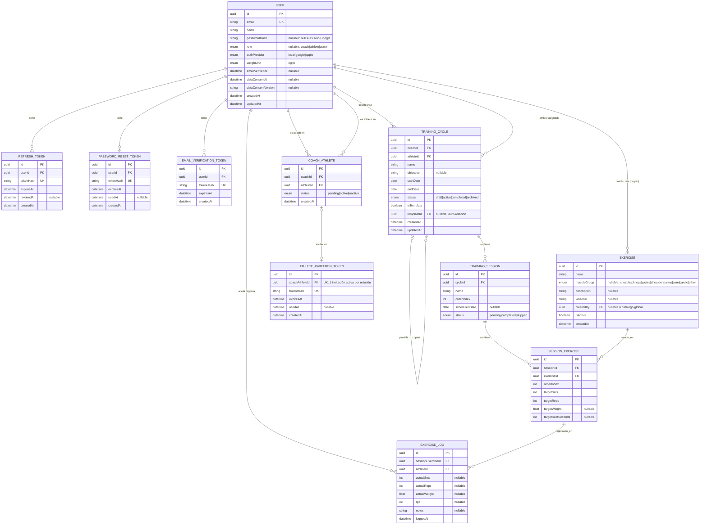

# PRD — Cycles: Plataforma de Ciclos de Entrenamiento

> Este es el **PRD padre del producto Cycles**. Cycles es, a su vez, el primer producto de una visión de compañía más amplia — ver [[VISION]]. Cada funcionalidad de Cycles se documenta en su propio PRD hijo dentro de `docs/prds/features/`, enlazado desde aquí. Ver [[README|convención de PRDs]] para cómo crear uno nuevo.

## 0. PRDs hijos / Funcionalidades

| Funcionalidad | Fase | Estado | PRD |
|---|---|---|---|
| Autenticación (manual + Google, verificación de email) | Fase 1 | in-progress | [[PRD-Autenticacion]] |
| Invitación de atletas | Fase 2 | in-progress | [[PRD-InvitacionAtletas]] |
| Catálogo de ejercicios | Fase 2 | in-progress | [[PRD-CatalogoEjercicios]] |
| CRUD de ciclos de entrenamiento | Fase 2 | superseded-parcial | [[PRD-CRUDCiclos]] |
| CRUD de sesiones y ejercicios de sesión | Fase 2 | superseded-parcial | [[PRD-CRUDSesiones]] |
| Frontend de planificación (ciclos/sesiones/ejercicios) | Fase 2 | in-progress | [[PRD-FrontendPlanificacion]] |
| Rutinas y programación en grid | Fase 2 | complete | [[PRD-RutinasYProgramacion]] |
| Ejecución y seguimiento (registro del atleta + seguimiento del coach) | Fase 3 | approved | [[PRD-EjecucionYSeguimiento]] |

> Esta tabla se actualiza a mano cada vez que se crea un PRD hijo nuevo (ver plantilla en `_templates/PRD-Feature-Template.md`). Además, como cada PRD hijo enlaza de vuelta a `[[PRD-General]]` en su frontmatter, el panel de **Linked mentions / Backlinks** de Obsidian en esta nota mostrará automáticamente todos los hijos, aunque se te olvide actualizar la tabla.

## 1. Resumen

Cycles es una aplicación web donde entrenadores (coaches) diseñan, asignan y dan seguimiento a ciclos de entrenamiento para sus atletas, y donde los atletas consultan sus sesiones y registran su progreso. Es, además, el primer producto de una compañía enfocada en correlacionar datos deportivos y de salud para impulsar el rendimiento atlético (ver [[VISION]]) — por lo que la calidad y consistencia de los datos que captura importan más allá del propio producto.

## 2. Problema

Los coaches hoy gestionan la planificación de entrenamientos en hojas de cálculo, PDFs o apps genéricas de mensajería, lo que dificulta el seguimiento histórico, la reutilización de planes y la visibilidad del progreso real del atleta.

## 3. Objetivos

- Permitir a un coach crear ciclos de entrenamiento estructurados (sesiones, ejercicios, cargas objetivo) y asignarlos a uno o más atletas.
- Permitir a un atleta ver su plan vigente y registrar lo realmente ejecutado (series, reps, peso, percepción de esfuerzo).
- Dar al coach visibilidad de la adherencia y el progreso de cada atleta.
- Soportar autenticación con Google y registro manual (email/contraseña) en el MVP; Apple queda para una fase posterior (ver [[PRD-Autenticacion]]).
- Capturar los datos de ejecución con la consistencia suficiente (unidades normalizadas, timestamps UTC, sin pérdida de detalle) para que puedan alimentar, más adelante, el motor de correlación descrito en [[VISION]].

### No objetivos (fuera del MVP)

- Pagos/suscripciones dentro de la plataforma (se retoma cuando exista tracción real, ver [[VISION]]).
- Nutrición y seguimiento de dieta.
- Chat en tiempo real entre coach y atleta (tampoco comentarios asíncronos por sesión en el MVP — se reevalúa en Fase 3).
- Multi-tenant por gimnasio/organización (se documenta como evolución futura, no se implementa en el MVP).
- Integraciones con wearables (Garmin, Polar, Google Fit, Strava): son parte de la visión de compañía, pero no se modelan ni implementan hasta que exista una integración real que las valide (ver [[VISION]], sección 3).
- Internacionalización: el MVP se construye solo en español; no se agrega capa de i18n todavía.

## 4. Usuarios y roles

| Rol | Descripción |
|---|---|
| **Coach** | Crea y gestiona atletas, ciclos, sesiones y ejercicios. Consulta el progreso de sus atletas. |
| **Atleta** | Pertenece a un único coach activo a la vez. Consulta sus ciclos/sesiones asignadas y registra su ejecución real. |
| **Admin** | Rol interno de plataforma para soporte y moderación (gestión de usuarios, catálogo global de ejercicios). |

Roles excluyentes: un usuario es coach **o** atleta, nunca ambos con la misma cuenta (si un coach quiere entrenar con otro coach, usa una segunda cuenta).

### Relación coach–atleta

- **Alta:** solo por invitación del coach (por email). El atleta no puede auto-registrarse eligiendo el rol "atleta" sin invitación previa; completa su registro (manual, o vinculando Google) a partir del link de invitación.
- **Cardinalidad:** un atleta tiene como máximo **un coach activo a la vez** (`CoachAthlete.status = 'active'` es único por atleta). Puede tener relaciones anteriores en `status = 'inactive'` (histórico).
- **Fin de relación:** cuando termina, la relación pasa a `inactive`. El **coach pierde acceso** a los ciclos/datos de ese atleta desde ese momento (sus queries solo consideran relaciones activas). El **atleta conserva acceso total** a su propio historial sin restricción. A nivel de compañía (no de producto), el dato no se borra — sigue existiendo como activo de datos sujeto al consentimiento del atleta (ver [[VISION]] y sección 8 de este documento).

## 5. Historias de usuario clave (MVP)

1. Como **coach**, quiero registrarme e iniciar sesión con Google o email/contraseña, para acceder a la plataforma con el método que prefiera. → detalle en [[PRD-Autenticacion]]
2. Como **coach**, quiero invitar a un atleta por email, para vincularlo a mi cuenta. → detalle en [[PRD-InvitacionAtletas]]
3. Como **coach**, quiero crear un ciclo de entrenamiento con nombre, objetivo, fechas de inicio/fin y sesiones, para planificar el trabajo de un atleta. → detalle en [[PRD-CRUDCiclos]]
4. Como **coach**, quiero agregar ejercicios a cada sesión con series/repeticiones/peso objetivo, para dejar instrucciones claras. → detalle en [[PRD-CRUDSesiones]]
5. Como **atleta**, quiero ver mi ciclo activo y las sesiones de la semana, para saber qué entrenar. → backend en [[PRD-CRUDSesiones]], sin UI todavía
6. Como **atleta**, quiero registrar lo que realmente hice en cada ejercicio (series, reps, peso, RPE), para dejar constancia de mi progreso. → detalle en [[PRD-EjecucionYSeguimiento]]
7. Como **coach**, quiero ver el historial de registros de un atleta por ciclo, para ajustar la planificación futura. → detalle en [[PRD-EjecucionYSeguimiento]]
8. Como **usuario**, quiero recuperar mi contraseña si me registré manualmente, para no perder acceso a mi cuenta. → detalle en [[PRD-Autenticacion]]

> A medida que se creen PRDs hijos para las historias 2–7 (invitaciones, ciclos, sesiones, registro de progreso), enlázalas aquí igual que se hizo con autenticación.

## 6. Modelo de datos (alto nivel)

> Actualizado el 2026-09-22 para reflejar el estado real de `apps/api/prisma/schema.prisma` (incluye las tablas de autenticación de [[PRD-Autenticacion]] y el token de invitación de [[PRD-InvitacionAtletas]], que antes no estaban en este diagrama).

```mermaid
erDiagram
    USER ||--o{ REFRESH_TOKEN : tiene
    USER ||--o{ PASSWORD_RESET_TOKEN : tiene
    USER ||--o{ EMAIL_VERIFICATION_TOKEN : tiene
    USER ||--o{ COACH_ATHLETE : "es coach en"
    USER ||--o{ COACH_ATHLETE : "es athlete en"
    USER ||--o{ TRAINING_CYCLE : "coach crea"
    USER ||--o{ TRAINING_CYCLE : "athlete asignado"
    USER ||--o{ EXERCISE : "coach crea (propio)"
    USER ||--o{ EXERCISE_LOG : "atleta registra"
    COACH_ATHLETE |o--o| ATHLETE_INVITATION_TOKEN : invitación
    TRAINING_CYCLE ||--o{ TRAINING_SESSION : contiene
    TRAINING_CYCLE |o--o{ TRAINING_CYCLE : "plantilla → copias"
    TRAINING_SESSION ||--o{ SESSION_EXERCISE : contiene
    EXERCISE ||--o{ SESSION_EXERCISE : usado_en
    SESSION_EXERCISE ||--o{ EXERCISE_LOG : registrado_en

    USER {
        uuid id PK
        string email UK
        string name
        string passwordHash "nullable: null si es solo-Google"
        enum role "nullable: coach|athlete|admin"
        enum authProvider "local|google|apple"
        enum weightUnit "kg|lb"
        datetime emailVerifiedAt "nullable"
        datetime dataConsentAt "nullable"
        string dataConsentVersion "nullable"
        datetime createdAt
        datetime updatedAt
    }
    REFRESH_TOKEN {
        uuid id PK
        uuid userId FK
        string tokenHash UK
        datetime expiresAt
        datetime revokedAt "nullable"
        datetime createdAt
    }
    PASSWORD_RESET_TOKEN {
        uuid id PK
        uuid userId FK
        string tokenHash UK
        datetime expiresAt
        datetime usedAt "nullable"
        datetime createdAt
    }
    EMAIL_VERIFICATION_TOKEN {
        uuid id PK
        uuid userId FK
        string tokenHash UK
        datetime expiresAt
        datetime createdAt
    }
    COACH_ATHLETE {
        uuid id PK
        uuid coachId FK
        uuid athleteId FK
        enum status "pending|active|inactive"
        datetime createdAt
    }
    ATHLETE_INVITATION_TOKEN {
        uuid id PK
        uuid coachAthleteId FK "UK, 1 invitación activa por relación"
        string tokenHash UK
        datetime expiresAt
        datetime usedAt "nullable"
        datetime createdAt
    }
    TRAINING_CYCLE {
        uuid id PK
        uuid coachId FK
        uuid athleteId FK
        string name
        string objective "nullable"
        date startDate
        date endDate
        enum status "draft|active|completed|archived"
        boolean isTemplate
        uuid templateId FK "nullable, auto-relación"
        datetime createdAt
        datetime updatedAt
    }
    TRAINING_SESSION {
        uuid id PK
        uuid cycleId FK
        string name
        int orderIndex
        date scheduledDate "nullable"
        enum status "pending|completed|skipped"
    }
    EXERCISE {
        uuid id PK
        string name
        enum muscleGroup "nullable: chest|back|legs|glutes|shoulders|arms|core|cardio|other"
        string description "nullable"
        string videoUrl "nullable"
        uuid createdBy FK "nullable = catálogo global"
        boolean isActive
        datetime createdAt
    }
    SESSION_EXERCISE {
        uuid id PK
        uuid sessionId FK
        uuid exerciseId FK
        int orderIndex
        int targetSets
        int targetReps
        float targetWeight "nullable"
        int targetRestSeconds "nullable"
    }
    EXERCISE_LOG {
        uuid id PK
        uuid sessionExerciseId FK
        uuid athleteId FK
        int actualSets "nullable"
        int actualReps "nullable"
        float actualWeight "nullable"
        int rpe "nullable"
        string notes "nullable"
        datetime loggedAt
    }
```

Ver el esquema completo (Prisma) en `apps/api/prisma/schema.prisma`. El modelo de datos completo es propiedad de este PRD general; los PRDs hijos solo documentan **deltas** (campos o tablas nuevas) cuando aplica, no lo repiten — el detalle de por qué existe cada tabla nueva vive en su PRD hijo ([[PRD-Autenticacion]] para las de token, [[PRD-InvitacionAtletas]] para `AthleteInvitationToken`, [[PRD-CatalogoEjercicios]] para `MuscleGroup`/`isActive`).

Notas sobre campos agregados tras la definición de [[VISION]]:

- `User.weightUnit` (`kg` | `lb`, default `kg`): preferencia de visualización del usuario. Todo se **almacena internamente en kg**; la conversión ocurre en la capa de presentación.
- `User.emailVerifiedAt`: nulo hasta que el usuario confirma su email (obligatorio para login manual; no aplica a login con Google).
- `User.dataConsentAt` / `dataConsentVersion`: consentimiento explícito del atleta para el uso de sus datos en analítica agregada/futura (ver [[VISION]], principio de consentimiento). Se captura en el registro.
- `TrainingCycle.isTemplate` / `templateId`: soporta que un coach cree un ciclo como plantilla y lo duplique para distintos atletas (`templateId` referencia al ciclo origen cuando aplica).
- `Exercise.createdBy`: nulo para el catálogo global (seed inicial), o el `id` del coach cuando es un ejercicio propio suyo (no visible para otros coaches).

## 7. Arquitectura técnica

Ver detalle completo en [`docs/ARCHITECTURE.md`](../ARCHITECTURE.md). Resumen:

- **Frontend:** React 18 + TypeScript + Vite, CSS Modules.
- **Backend:** Node.js + TypeScript + NestJS, arquitectura modular por dominio.
- **Base de datos:** PostgreSQL (relacional) + Prisma ORM.
- **Autenticación:** JWT (access + refresh token), OAuth 2.0 con Google (Apple pospuesto, ver [[PRD-Autenticacion]]), registro/login manual con email + contraseña (hash con bcrypt) y verificación de email obligatoria.
- **API:** REST, documentada con OpenAPI/Swagger.
- **Estructura:** Monorepo (npm workspaces) con `apps/web`, `apps/api` y `packages/shared` (tipos y contratos compartidos).

## 8. Requisitos no funcionales

- **Seguridad:** contraseñas hasheadas (bcrypt), tokens JWT de corta duración + refresh rotativo, validación de entrada en cada endpoint, protección CSRF/XSS estándar, rate limiting en endpoints de auth.
- **Privacidad:** los datos de entrenamiento y progreso físico son datos personales; un atleta solo es visible para los coaches con relación activa.
- **Responsive / mobile-first:** los atletas registrarán su progreso mayoritariamente desde el celular durante el entrenamiento.
- **Accesibilidad:** cumplir contraste y navegación por teclado (WCAG AA) como línea base.
- **Escalabilidad:** el modelo de datos y la API deben soportar, sin rediseño, que un coach tenga cientos de atletas.
- **Disponibilidad de datos:** exportable (al menos el catálogo de ejercicios y ciclos) para no generar lock-in.
- **Integridad para uso futuro en analítica:** los registros de ejecución (`ExerciseLog`) son append-only — no se editan destructivamente ni se resumen sin conservar el dato crudo; todos los timestamps se almacenan en UTC. Ver [[VISION]], sección 3.
- **Gobernanza de datos:** ningún dato de un atleta se usa para análisis agregado o cruzado entre atletas sin `dataConsentAt` registrado.

Estos son los NFR de plataforma. Un PRD hijo solo debe listar NFR **adicionales o más estrictos** que apliquen específicamente a su funcionalidad.

### 8.1 Reglas de seguridad (obligatorias para todo el proyecto)

Convenciones que ya sigue el código y que todo cambio (código, infraestructura, documentación, PRDs hijos) debe respetar. El detalle, los archivos sensibles y la auditoría viven en [`docs/SEGURIDAD.md`](../SEGURIDAD.md); si un cambio necesita romper una regla, primero se actualiza ese documento.

1. **Secretos (R1):** nunca en el repo, issues, PRs ni conversaciones; distintos por entorno y entre sí (JWT access ≠ refresh, ≥64 caracteres); API keys con permiso mínimo; nada secreto en variables `VITE_*`.
2. **Autenticación (R2):** bcrypt costo 12; access token de 15 min; refresh de 30 días rotativo, hasheado y con detección de reuso; tokens de un solo uso aleatorios, hasheados (SHA-256) y con vencimiento; cambiar la contraseña revoca las sesiones; login manual solo con email verificado.
3. **No revelar si una cuenta existe (R3)** en recuperación de contraseña y reenvío de verificación.
4. **Roles (R4):** coach o atleta, nunca ambos; el atleta solo se crea por invitación; cada endpoint declara su rol.
5. **Propiedad de los datos (R5):** además del rol, cada servicio verifica que el dato sea del usuario; el coach accede a un atleta solo con la relación activa; el atleta siempre a lo suyo.
6. **Validación (R6):** DTO con `class-validator` en todo endpoint; texto del usuario escapado antes de ir a HTML.
7. **Integridad y privacidad (R7):** registros de ejecución append-only, UTC, y sin análisis entre atletas sin consentimiento.
8. **Logs (R8):** nunca contraseñas, tokens ni enlaces con token en producción.
9. **Fallas externas (R9):** una falla de un servicio externo no revela información ni deja datos a medias.
10. **Frontend (R10):** sin `dangerouslySetInnerHTML` ni HTML armado con texto del usuario.
11. **Dependencias (R11):** `npm audit --omit=dev` antes de cada deploy; sin vulnerabilidades altas o críticas en producción sin una razón escrita.
12. **Proceso (R12):** todo entra por PR; los cambios que tocan autenticación, roles o propiedad dicen qué se probó para los casos prohibidos.

## 9. Métricas de éxito (MVP)

- % de sesiones planificadas que quedan con registro de ejecución (adherencia).
- Nº de ciclos creados por coach activo.
- Tiempo desde registro hasta la creación del primer ciclo (activación).
- Retención de atletas a 4 semanas.

## 10. Roadmap por fases

| Fase | Alcance | PRDs |
|---|---|---|
| **Fase 0 — Fundacional** | PRD, arquitectura, scaffolding del monorepo, modelo de datos base. | — |
| **Fase 1 — Auth & onboarding** | Registro/login manual + Google, verificación de email, invitación coach→atleta. | [[PRD-Autenticacion]] |
| **Fase 2 — Planificación** | Invitación de atletas; catálogo de ejercicios; rutinas y programación en grid (ciclos/sesiones). | [[PRD-InvitacionAtletas]], [[PRD-CatalogoEjercicios]], [[PRD-RutinasYProgramacion]] |
| **Fase 3 — Ejecución y seguimiento** | Registro de ejecución real (`ExerciseLog`), vista de progreso/adherencia para el coach. | [[PRD-EjecucionYSeguimiento]] |
| **Fase 3.5 — Piloto (actual)** | Deploy completo (dominio `getcycles.app`, Resend, Supabase, Render, Vercel, Google OAuth), **tanda 1 de seguridad** (dependencias, endurecer la API, Google sin tokens en la URL, cabeceras, alertas de seguridad a Slack) y **avisos de actividad del piloto** en Slack. Termina con 2–3 coaches reales usando la app. | `docs/deploy/PLAN-Deploy.md`, `docs/PLAN-Seguridad.md` (tanda 1) |
| **Fase 4 — Evolución** | Multi-tenant (gimnasios/academias), notificaciones, métricas avanzadas, app móvil nativa. **Requisito para empezarla:** tanda 2 de seguridad (refresh token en cookie `httpOnly`, tokens de la app móvil en el Keychain, tests de autorización y CI). | *(pendiente)*, `docs/PLAN-Seguridad.md` (tanda 2) |

La **tanda 3** de `docs/PLAN-Seguridad.md` (tiempos del login y append-only en la base) son mejoras sin fase fija: se hacen cuando haya espacio, antes de que crezca el volumen de datos.

### 10.1 Checklist de cierre de cada fase

Una fase (o un PR grande dentro de ella) no se da por terminada hasta verificar esta lista. Es la forma de no depender de la memoria: se revisa **siempre**, aunque la fase parezca no tocar el tema.

**Seguridad**
- [ ] El cambio respeta las reglas de §8.1 (detalle en `docs/SEGURIDAD.md` §2).
- [ ] Cada endpoint nuevo tiene DTO, rol declarado y chequeo de propiedad, y se probaron los casos prohibidos: sin sesión, otro rol, otro dueño, relación inactiva.
- [ ] `npm audit --omit=dev` sin vulnerabilidades altas ni críticas, o cada excepción anotada en `docs/SEGURIDAD.md`.
- [ ] Ningún secreto nuevo en el repo; las variables nuevas están en el `.env.example` que corresponda y en la lista de validación al arrancar.
- [ ] `docs/SEGURIDAD.md` actualizado: archivos sensibles nuevos y hallazgos resueltos o nuevos.

**Producto y datos**
- [ ] El PRD de la funcionalidad tiene su estado al día, y la tabla de §0 también.
- [ ] Si cambió el esquema: migración nueva (nunca editar una aplicada) y diagrama del modelo de datos actualizado (§6 y `docs/diagrams/modelo-relacional.html`).
- [ ] `docs/enlaces.md` al día con las rutas y endpoints nuevos.

**Diseño y textos**
- [ ] Textos en español latino con "tú", sin voseo.
- [ ] Sin subtítulos grises bajo los títulos; colores y tipografía del Design System.

**Calidad y proceso**
- [ ] Typecheck y build de los workspaces tocados, sin errores.
- [ ] Probado a mano de punta a punta (y con tests automáticos cuando existan: tanda 2 de seguridad). Lo que quede sin probar se anota en `docs/PRUEBAS-PENDIENTES.md`.
- [ ] Todo entra a `main` por PR, con una descripción de qué se probó.

## 11. Decisiones abiertas

Decisiones resueltas el 2026-09-19:

- **Hosting/infraestructura:** **Supabase** (Postgres administrado). Se usa su base de datos administrada; el resto de servicios de auth/storage de Supabase no se usan porque ya hay auth propio implementado.
- **Proveedor de email transaccional:** **Resend**. Reemplaza el `MailService` de desarrollo (que solo loguea el link) en `apps/api/src/mail/mail.service.ts`.
- **Gestión de estado en frontend:** **React Query** (estado de servidor) + **Context** (estado de UI simple). No se suma Zustand por ahora.
- **Cumplimiento normativo específico:** mercado objetivo inicial **LATAM / España**; no se asume GDPR pleno de entrada. El consentimiento explícito (`dataConsentAt`) ya implementado es la base mínima suficiente para este alcance. Se reevalúa si se expande a UE/EE.UU.
- **Presupuesto de infraestructura:** tier gratuito / **<$25 USD/mes** para el MVP (cubierto por el free tier de Supabase + Resend).
- **Naming:** **"Cycles"** e **"InProgress Co."** quedan confirmados como nombres definitivos (se asume el riesgo de marca sin búsqueda previa).

Decisiones resueltas el 2026-09-22:

- **Hosting de la aplicación** (distinto de Supabase, que solo aloja la base de datos): **Vercel** para el frontend (`apps/web`, build de Vite servido como estático) y **Render** para la API (`apps/api`, proceso NestJS de larga duración). Falta configurar ambos servicios y las variables de entorno de producción (secrets de JWT, `DATABASE_URL` de Supabase, `RESEND_API_KEY`, credenciales de Google OAuth, CORS restringido al dominio de Vercel).

Pendiente:

- **Estrategia de versión de API:** por definir cuando exista consumo externo (móvil nativo, integraciones). Se deja deliberadamente sin decidir hasta que sea necesario.
